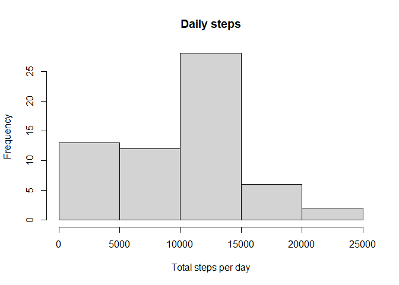
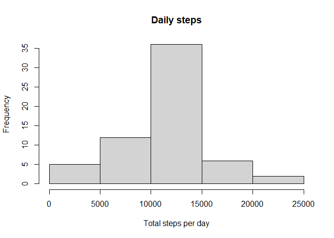

## Loading and preprocessing the data


``` r
unzip("activity.zip")
activity <- read.csv("activity.csv")
```


## What is mean total number of steps taken per day?


``` r
library(dplyr)

grouped_activity <- group_by(activity, date) 
daily_activity <- summarize(grouped_activity, 
          mean = mean(steps, na.rm = TRUE), 
          total = sum(steps, na.rm = T) 
          )
```


``` r
steps_mean <- mean(daily_activity$mean, na.rm = T)
steps_median <- median(daily_activity$mean, na.rm = T)

#steps_mean <- round(steps_mean, digits = 3) 
#steps_median <- round(steps_median, digits = 3) 
```
The mean number of steps taken is  37.3825996

The median number of steps taken is 37.3784722

<!-- -->


## What is the average daily activity pattern?

``` r
grouped_activity <- group_by(activity, interval) 
interval_activity <- summarize(grouped_activity, 
          interval_mean = mean(steps, na.rm = TRUE) )

with(interval_activity, plot(interval, interval_mean, type = "l",
                    main = "Interval steps taken", 
                    xlab = "5 minute interval index", ylab = "Average steps") )
```

<!-- -->


``` r
max_interval <- interval_activity$interval[which.max(interval_activity$interval_mean)]
```

The interval that has the highest number of steps on average is interval 835


## Imputing missing values

``` r
total_nas <- sum(is.na(activity$steps))
```

The total NA values are 2304

Imputing using the average for that interval across all days

``` r
for(index in seq_along(activity$steps)) {
  if (is.na(activity$steps[index]) ) {
    interval_mean_index <- which(activity$interval[index] == interval_activity$interval)
    interval_mean <- interval_activity$interval_mean[interval_mean_index]
    activity$steps[index] = interval_mean
  }
 
}
```


``` r
grouped_activity <- group_by(activity, date) 
daily_activity <- summarize(grouped_activity, 
          mean = mean(steps, na.rm = TRUE), 
          total = sum(steps, na.rm = T) 
          )
```


``` r
steps_mean <- mean(daily_activity$mean, na.rm = T)
steps_median <- median(daily_activity$mean, na.rm = T)
```
The mean number of steps taken is  37.3825996

The median number of steps taken is 37.3825996

<!-- -->


## Are there differences in activity patterns between weekdays and weekends?


``` r
activity$date <- as.Date(activity$date)

activity_weekdays <- weekdays(activity$date)
weekday_factor <- as.factor(ifelse(activity_weekdays %in% c("Saturday", "Sunday"), "weekend", "weekday"))

activity$weekday <- weekday_factor

weekend_activity <- activity[activity$weekday == "weekend",]

weekday_activity <- activity[activity$weekday == "weekday",]

#mean(weekday_activity$steps)
#mean(weekend_activity$steps)

grouped_weekend_activity <- group_by(weekend_activity, interval) 
averaged_weekend_activity <- summarize(grouped_weekend_activity, 
                                      interval_mean = mean(steps, na.rm = TRUE),
                                      weekday = "weekend")

grouped_weekday_activity <- group_by(weekday_activity, interval) 
averaged_weekday_activity <- summarize(grouped_weekday_activity, 
                                      interval_mean = mean(steps, na.rm = TRUE),
                                       weekday = "weekday")

averaged_data <- bind_rows(averaged_weekend_activity, averaged_weekday_activity)
averaged_data$weekday <- as.factor(averaged_data$weekday)
library(lattice)
xyplot(interval_mean ~ interval | weekday, data = averaged_data, type="l", layout = c(1, 2), xlab = "Interval", ylab = "Steps", main = "Weekend vs Weekday Activity")
```

<!-- -->

On average, the weekend activity is higher, but weekday activity has a higher spike earlier in the day.

## Notes


